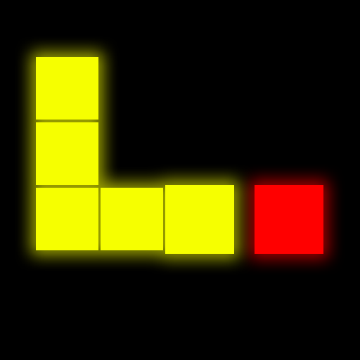

#  Neon Snake

Simple Snake Game made in Unity. First project where i was learning how to use Unity.
Apart from the gameplay itself, game contains things like Main menu, settings and game over menu.
Game developed for Android.

## Current apk version: 1.1

## Download

You can download current version of the .apk _[here](https://www118.zippyshare.com/v/2HMszNMa/file.html)_.

## Changelog

* v.1.2
    - change controls to two arrows on edges of the screen
    - add post processing fx - bloom

* v.1.1
    - fix version number position

* v.1.0
    - icon
    - first apk build